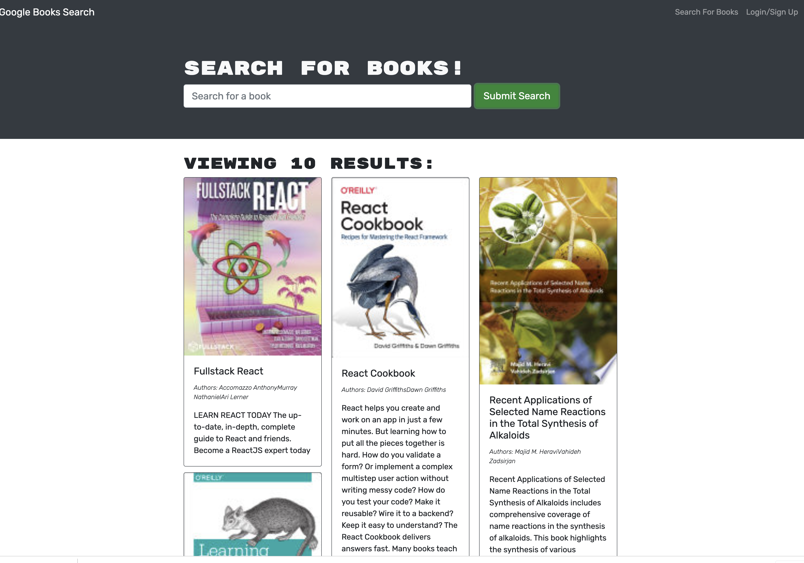
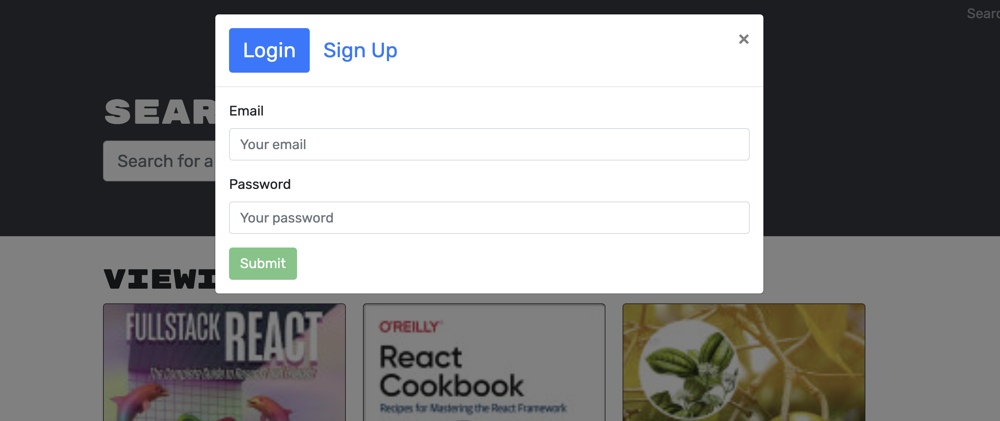

# MERN: Books_Search_Engine

Usage of Google Books API to create an GraphQL API with Apollo Server. MERN stack is implemented to create the app. User can sign up and log in for an account, search for a book of their liking and added to a list of saved books, users can also remove the saved books.

 

## User Story
AS an avid reader,
User wants to search for new books to read
So that they can keep a list of books to purchase.

## Table of Contents 
1. [Project Links](#Project-Links)
1. [Screenshot](#Screenshot)
1. [Deployed App](#Deployed-App)
1. [Installation](#Installation)
1. [Contribution Guidelines](#Contribution-Guidelines)
1. [Questions](#Questions)

## Screenshot

 

## Deployment
[Deployed App]( https://sadegh-book-search-engine-app.herokuapp.com/)

## Instructions
* To use this app npm init has to be called to create your `package.json` file.
* The following necessary `Npm` dependencies must be installed to run the application properly: the needed dependencies will be found on the `package.json` file. Simply run `npm i` to install the needed dependencies.
* To properly install the database you must create at cluster on `Mongodb atlas`.
* Run `npm start` for the port to start listening with mongoose.
* This app is deployed on `Heroku`

#### Languages and libraries used in this project:
- <a href="https://nodejs.org/">Node.js</a>
- <a href="https://www.npmjs.com/package/express">Express.js</a>
- <a href="https://www.mongodb.com/">MongoDB</a>
- <a href="https://mongoosejs.com/">Mongoose</a>
- <a href="https://www.javascript.com/">JavaScript</a>
- <a href="https://reactjs.org/">REACT</a>
- <a href="https://www.apollographql.com/docs/apollo-server/">Apollo Server</a>
- <a href="https://graphql.org/">GraphQL</a>
- <a href="https://www.npmjs.com/package/dotenv">dotenv</a>
- <a href="https://www.heroku.com/">Heroku</a>

## Contribution Guidelines:

[Sadegh.M](https://github.com/Sadegh777/book-search-engine.git)  

## Questions

    
Contact

    msm.officially@gmail.com

